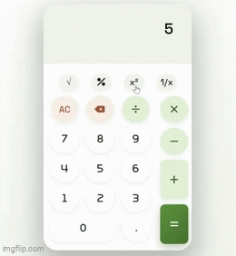

<div align="center">

# 🧮 JavaScript Calculator

A clean, responsive calculator built from scratch with **vanilla HTML, CSS and JavaScript** — no frameworks, no libraries for the logic.

[](https://java-script-calculator-green.vercel.app/)


**[🚀 Try it live](https://java-script-calculator-green.vercel.app/)**




</div>

---

## 📖 About

This is my first practical JavaScript project, built on my own to understand how a calculator really works under the hood: how input is stored, how operators are read in the right order, and how the screen updates while you type.

The goal was not just to make it work, but to **understand every line of the logic** and be able to debug it myself.

## ✨ Features

- ➕ ➖ ✖️ ➗ Basic operations with **correct order of calculation** (multiplication and division before addition and subtraction)
- √ Square root, `%` percent, `x²` square and `1/x` reciprocal
- 🔢 Decimal number support
- ⚡ **Live result** shown while you type
- ⌫ Delete last character and `AC` to clear everything
- 🚫 Double operators are blocked (no `5++3` mistakes)
- ↩️ Proper `=` state handling after a result is shown
- 📱 Responsive layout, works on phones and desktops
- 💡 Blinking cursor in the input display for a real calculator feel

## 🛠️ Tech Stack

| Technology | Used for |
| --- | --- |
| **HTML5** | Page structure and buttons |
| **CSS3** | Layout, styling and responsive design |
| **JavaScript (ES6)** | Calculator logic and DOM updates |
| **Font Awesome 7** | Button icons |
| **Google Fonts (Space Grotesk)** | Typography |
| **Vercel** | Hosting |

## 📂 Project Structure

```text
JavaScript-Calculator/
├── index.html   # Structure of the calculator
├── style.css    # All styling and responsive rules
├── script.js    # Calculator logic
├── docs/        # Screenshot for this README
└── README.md
```

## 🚀 Getting Started

No installation or build step is needed.

```bash
# 1. Clone the repository
git clone https://github.com/GhaZanfar377/JavaScript-Calculator.git

# 2. Go into the folder
cd JavaScript-Calculator
```

Then open the project with a local server (for example the **Live Server** extension in VS Code) or simply open `index.html` in your browser.

## 🧠 How It Works

1. Every button carries its value in a `data-value` (or `data-action`) attribute.
2. One click handler reads that attribute and updates the current expression.
3. Binary operators (`+ - × ÷`) are calculated in the correct precedence order.
4. A separate function handles unary operators: `√` (before a number) and `%` (after a number).
5. The result is calculated live and shown under the input, and pressing `=` locks it in.

## 📚 What I Learned

### 🌿 Git (the biggest lesson)

I decided to learn Git **while building this project**, and I practiced it from the very first day. This repo is my practice ground, so the commit history shows the real journey.

| Command | How I used it |
| --- | --- |
| `git add` / `git commit` | Saved my work in small steps with clear messages |
| `git push` | Sent my work to GitHub |
| `git branch` / `git merge` | created separate branch for unary operations and merged that back to main |
| `git stash` / `git stash apply` / `git stash pop` | Put half-done work aside safely and brought it back later |
| `git diff` | Checked exactly what changed before committing |
| `git log` | Looked back at the history of my decisions |
| `git restore` | Undid mistakes without panic |

Before this, I thought Git was only a button to upload finished code. Now I understand it is a **version control tool** that protects my work from the first minute.

### 💻 JavaScript and code quality

- Working with the **DOM**: selecting elements, reading `data-` attributes and updating the screen
- Managing **application state** (current input, result, and "just pressed =" state)
- Handling **edge cases**: double operators, decimals, and operator precedence
- Writing functions that do **one job only**. A few functions in this project still do more than one thing, and I know it. I understand the rule now and will follow it in my next projects.

## 🔮 Future Improvements

- [ ] Handle more advanced operations
- [ ] Light / dark theme toggle
- [ ] Refactor the remaining functions so each one does a single job

## 👤 Author

**Ghazanfar Iqbal**

- GitHub: [@GhaZanfar377](https://github.com/GhaZanfar377)

- LinkedIn: [Ghazanfar Iqbal](www.linkedin.com/in/ghazanfar-iqbal-b0a58638b)

---

<div align="center">

⭐ If you liked this project, consider giving it a star!

</div>